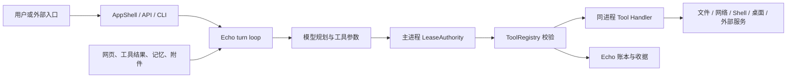
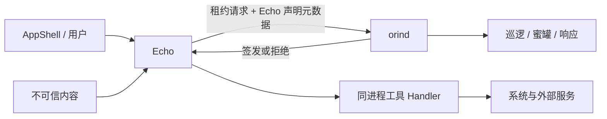
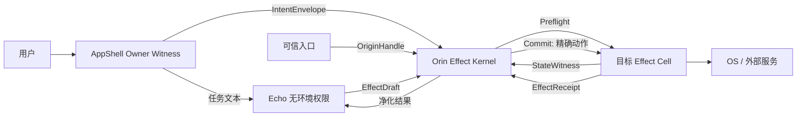
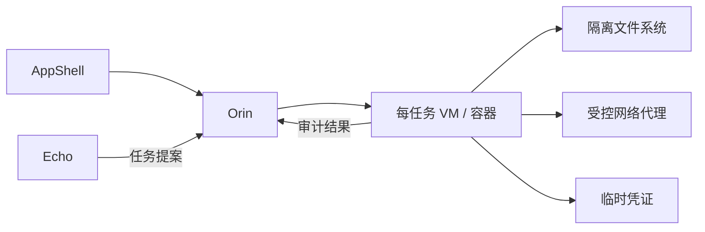
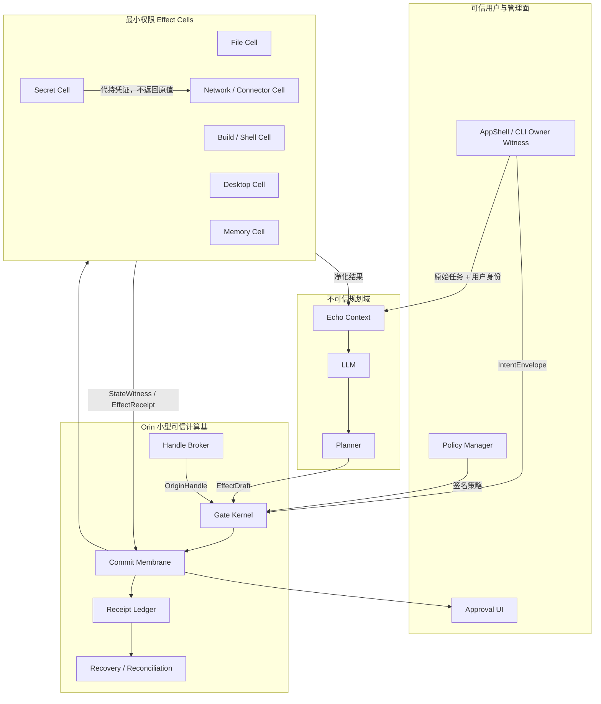
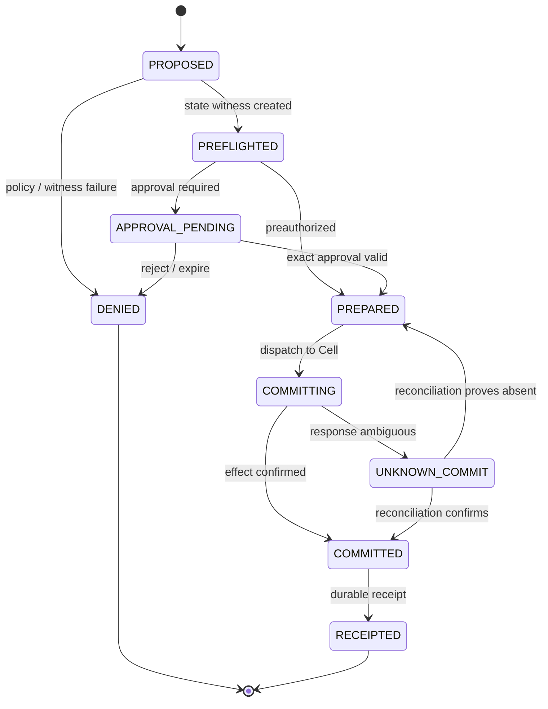

# Orin Effect Kernel：JS Agent“员工—保安”安全架构设计

> 状态：设计提案，尚未实施、尚未完成性能验证或安全验收  
> 目标产品：JS Agent / Echo Runtime  
> 设计范围：Orin 安全边界、效果执行、凭证隔离、故障恢复与验证体系  
> 证据快照日期：2026-08-22（Asia/Shanghai）  
> 仓库版本：`d33d3723b6ae30cc85824ccaccd291e3f7854d77`，分支 `feature/echo-runtime`  
> 当前工作树：在创建本文档前有 177 个已修改路径、91 个未跟踪路径；本文档不代表这些改动已经通过验收  
> 现有草案快照：`docs/security/orin/ORIN_DESIGN.md` v1.3，SHA-256  
> `1cf2f758f98c1b2fef923b3f013e91d549b6ee6db686f997a7b04e9e7d6219ad`；该文件在调研期间持续被其他流程修改，本文不覆盖它

---

## 1. 执行摘要

我们希望把 Echo 变成真正的软件“员工”：它负责理解需求、制定计划、使用工具、处理文件、连接服务、操作桌面并持续完成工作。与此同时，Orin 作为“保安”，不能只是给员工提醒风险，也不能依赖员工诚实汇报自己接触过什么数据。Orin 必须独立掌握门禁、钥匙和真实副作用的执行权。

本文推荐的最终方向是 **Orin Effect Kernel（效果内核）**，核心可以概括为：

> **三证一膜、零环境权限、许可证不经过 Echo。**

“三证”分别是：

1. **主人证（Intent Envelope）**：证明用户或管理员允许哪一类效果、作用于哪些资源、预算和期限是多少；只能由 Echo 控制面之外的 AppShell 或可信自动化清单签发。
2. **来源证（Origin Handle）**：证明路径、收件人、服务端点、账号、密钥和数据来自哪个可信入口；模型文本不能自行制造这些权限对象。
3. **状态证（State Witness）**：由实际执行组件在提交前读取真实世界，证明目标对象、版本、影响范围和可逆性没有被替换。

“一膜”是 **提交膜（Commit Membrane）**：任何会改变文件、外部服务、桌面、账号或现实世界状态的动作，都必须在这里完成预检、暂存、审批、持久化准备、执行和收据登记。

Echo 在此架构中是一个**不可信但有用的规划器**。它可以提出 `EffectDraft`，但不持有真实凭证、任意网络连接、工作区外写权限、系统 shell 权限或桌面控制权。Orin 校验三证后，直接把精确动作发送给隔离的 Effect Cell；一次性许可不返回 Echo，因此即使 Echo 被提示注入完全控制，或者其 Python 进程发生 RCE，也不能只靠“我是合法 Echo 进程”获得新的权限。

我们应当诚实说明原创性边界。学术界和开源社区已经分别研究了控制流/数据流分离、参数级来源追踪、意图授权、执行内核、动作证书和事务化副作用。本文不声称发明了全新的安全原语，也不构成专利新颖性或自由实施（FTO）结论。它的差异化是针对 JS Agent 当前代码和产品目标，把这些原则收敛为一套新的组合边界：

- 权限来源独立于 Echo；
- 权限参数使用不透明句柄，而不是模型自由文本；
- Orin 自己调度执行组件，许可不交给被保护进程；
- 可逆动作走低延迟暂存通道，不可逆动作走强持久化提交通道；
- 内容检测和蜜罐只负责报警，不能成为允许当前副作用的依据；
- 在生产强制模式下不存在“Orin 故障后自动回退到旧权限路径”。

在当前约束下，我推荐本文的 **方案二：Orin Effect Kernel**。继续增强现有 sidecar 可以作为迁移阶段；每任务 microVM 可以作为高危技能的加强模式，但不适合作为所有普通工具调用的默认路径。

---

## 2. 文档边界与证据等级

### 2.1 本文是什么

本文是一份可进入设计评审的安全架构提案，包含：

- 当前实现和信任边界；
- Orin 子系统威胁模型；
- 可证伪的安全不变量；
- 三种不同路线及工程权衡；
- 推荐架构、协议草案和状态机；
- 性能、资源、稳定性与运维目标；
- 分阶段迁移、回退、测试和验收门槛。

### 2.2 本文不是什么

- 不是“Orin 已经实现”的声明；
- 不是一次完成的漏洞扫描报告；
- 不是现有审计候选已经确认或修复的证明；
- 不是性能实测报告；
- 不是对 root、内核、物理攻击或恶意设备主人的完整防御承诺；
- 不是专利新颖性或 FTO 法律意见。

### 2.3 证据标签

本文用以下标签区分事实与设计：

| 标签 | 含义 | 可接受依据 |
| --- | --- | --- |
| **已观察** | 在本次只读检查中直接看到 | 当前源代码、Git 状态、现有文档、官方规范 |
| **已推断** | 从已观察边界得到的工程判断 | 明确写出推理链和限制 |
| **拟议** | 尚未实现的目标架构或接口 | 必须附验证与回退计划 |
| **目标值** | 将来用于验收的阈值 | 不得写成当前实测成绩 |

### 2.4 当前证据清单

| 证据 | 类型 | 它证明什么 |
| --- | --- | --- |
| `js/echo/types.py:89` 的 `CapabilityLease` | 已观察 | 当前租约会绑定工具、参数摘要、文件根、网络策略、预算、次数和期限 |
| `js/echo/capability.py:330` 的 `LeaseAuthority` | 已观察 | HMAC 密钥、签发、核验、核销和吊销状态当前由 Python authority 持有 |
| `js/agent/tool_executor.py:4757` | 已观察 | 正常 Echo 工具路径会在主进程中计算约束并签发租约 |
| `js/agent/tool_executor.py:4916` | 已观察 | 工具租约密钥当前从状态目录加载，并在主进程构造 `LeaseAuthority` |
| `js/tools/registry.py:655` | 已观察 | 工具注册 handler 最终仍在当前 Python 进程调用 |
| `js/echo/effect_interpreter.py:271` | 已观察 | Echo effect interpreter 最终回调 agent 的工具执行器 |
| `js/security/runtime_tcb.py:1` | 已观察 | 当前存在应用层 TCB 写保护，但它不是独立 OS 权限边界 |
| `js/agent/prompt_builder.py:241` | 已观察 | Echo 视觉附件仍要求单独的视觉安全批准 |
| `js/tools/desktop_tools.py:240` 与 `js/tools/registry.py:78` | 已观察 | 截图像素位于 metadata，而模型工具消息使用 `to_text()` 文本路径 |
| `desktop/src-tauri/Cargo.toml:1` | 已观察 | 项目已有 Rust/Tauri 桌面壳，可承载小型本地安全内核或原生服务集成 |
| `docs/security/orin/ORIN_DESIGN.md` v1.3 | 已观察、未实施文档 | 当前 sidecar、污点、蜜罐、响应和密级分区设想；不是运行时代码 |

本次没有运行测试或基准。历史深度扫描只应作为寻找风险面的线索；其中尚未完成集中验证的候选不能在本文中升级成“确认漏洞”。

---

## 3. 当前架构与结构性缺口

### 3.1 当前正常执行路径

下面的图只表示从当前源代码观察到的安全相关抽象，不表示每个模块都没有其他内部步骤。



当前设计已经比“模型直接调用函数”强很多：正常路径需要 Echo 上下文、参数哈希、文件和网络约束、单次租约及注册表核验；缺失或不一致时倾向于 fail-closed。我们应当保留这些战术保护，直到新边界完全接管。

### 3.2 缺口一：授权者和被保护者仍处于同一失陷域

**已观察：** 主进程构造 `LeaseAuthority`，工具 handler 最终也在同一 Python 进程执行。

**已推断：** 当威胁只是假设“模型输出被提示注入控制，但 Python 进程本身仍可信”时，现有租约可以阻止很多越权调用。当威胁提升为“Echo 进程发生任意代码执行”时，攻击者不再受 Python API 使用约定约束：它可以读取进程可见密钥、调用内部对象，或者绕过 ToolRegistry 直接使用操作系统权限。

因此，安全声明必须分层：

- **模型/规划层失陷**：当前正常工具路径已有一定防护；
- **Echo 进程失陷**：只有移除 Echo 的环境权限并外置真实执行后，Orin 才能形成可靠边界；
- **Orin 或 Effect Cell 失陷**：需要更小 TCB、分 Cell 权限和 OS 沙箱限制爆炸半径；
- **root/内核失陷**：超出本文保证范围。

### 3.3 缺口二：进程身份不能证明用户当前意图

把签发密钥移到独立 `orind` 是正确方向，但还不充分。被攻破的 Echo 仍然是合法 IPC 客户端；peer credential、audit token 或握手 HMAC 只能说明“这个请求来自 Echo”，不能说明“用户刚才要求删除这些文件”或“用户允许把这些内容发送到这个收件人”。

如果 Orin 接受 Echo 自己声明的 `intent`、`context_taint`、`arg_taint` 或风险级别，它实际上仍在让员工给自己开门。独立的主人证必须经由 Echo 无法写入的通道产生。

### 3.4 缺口三：模型文本仍可决定权限型参数

提示注入真正危险的地方，不只是它让模型调用了某个工具，而是它能够改变：

- 发给谁；
- 写到哪里；
- 访问哪个账号或租户；
- 请求哪个域名、IP 或回调地址；
- 使用哪一个密钥；
- 执行什么命令；
- 花费多少资金或外部配额。

工具级“允许/禁止”太粗。Orin 必须区分普通内容参数与**承载权限的参数**。后者不能直接接受模型生成的任意字符串。

### 3.5 缺口四：内容污点不是可靠的主授权依据

粗粒度污点、n-gram 重叠、关键词和蜜罐可以发现一部分攻击，但存在无法消除的局限：

- 被攻破的 Echo 可以少报或伪造污点；
- 恶意影响可以通过转述、摘要、编码或计划状态存活；
- 内容滑出上下文不等于其影响消失；
- 启发式匹配存在误报和漏报；
- 蜜罐只能证明某些已知诱饵被读取或泄露，不能证明其他数据安全；
- 异步检测在不可逆动作已经发生后才报警，无法撤回当前效果。

因此，污点和蜜罐适合用于收紧后续权限、触发隔离和提供调查证据，不适合成为当前不可逆动作的放行条件。

### 3.6 缺口五：回滚不能只依靠文件系统克隆

APFS `clonefile` 可以成为本地文件恢复的优化手段，但它不是涵盖邮件、支付、消息、远程 API、账号权限和桌面点击的全局事务。可靠的“可撤销世界”需要按效果类型设计：

- 文件：暂存、差异、原子替换、版本收据；
- 邮件和消息：草稿箱与 outbox；
- 外部 API：预检、幂等键、服务端版本、补偿动作；
- 支付或灾难级动作：双签、冷静期和人工确认；
- 桌面操作：窗口和控件状态见证、每步后观察、不可逆按钮单独审批。

---

## 4. Orin 子系统威胁模型

### 4.1 需要保护的资产

1. **身份与凭证**：OAuth token、API key、Cookie、证书、SSH key、系统钥匙串权限。
2. **本地数据**：项目源码、工作文档、下载文件、个人目录、企业资料和运行时状态。
3. **持久记忆**：工作记忆、长期记忆、摘要、任务计划、用户偏好和检索索引。
4. **外部身份与效果**：邮件、消息、代码托管、日历、工单、支付、云资源和第三方账号。
5. **执行环境**：shell、Python、浏览器、桌面控制、安装器、技能和 MCP 连接。
6. **安全控制本身**：Orin 策略、签名密钥、审批记录、吊销状态、收据链和证据卷。
7. **可用性**：不能因为恶意输入、洪水请求或单个 Cell 崩溃而导致整套 JS Agent 长时间失效。

### 4.2 攻击者与输入来源

| 编号 | 攻击者或失陷源 | 能力假设 |
| --- | --- | --- |
| A0 | 恶意网页、邮件、文档、聊天消息 | 能把提示注入、诱导文本或编码载荷放入 Echo 可见内容 |
| A1 | 恶意/被替换的 MCP、技能、插件或工具描述 | 能返回伪造元数据、恶意结果、供应链代码或 rug-pull 更新 |
| A2 | 被完全劫持的模型规划层 | 能生成任意工具名、参数、解释、审批诱导文案和多步计划 |
| A3 | Echo Python 进程 RCE | 能调用进程内函数、读取其内存和文件描述符，并尝试直接访问 OS |
| A4 | 同一普通用户下的恶意本机进程 | 能探测 IPC、洪水请求、尝试调试或读取同用户文件；不能假设它自动拥有管理员/root |
| A5 | 操作失误或审批疲劳 | 合法用户可能误点、过度常设授权或批准被误导的摘要 |
| A6 | Orin/Cell 实现漏洞 | 能利用解析器、协议、执行器或恢复逻辑中的普通软件缺陷 |

### 4.3 明确的信任边界

1. **用户/AppShell 与 Echo 之间**：AppShell 可以证明认证用户和原始交互事件；Echo 不能代表用户自行扩权。
2. **Echo 与 Orin 之间**：Echo 的所有请求都是不可信提案，哪怕 IPC 客户端身份合法。
3. **Orin 与 Effect Cell 之间**：Orin 决定，Cell 只执行自己类别内的精确动作；每个 Cell 权限不同。
4. **Effect Cell 与操作系统/外部服务之间**：这是必须完整仲裁的最终副作用边界。
5. **可信入口与模型内容之间**：入口签发来源元数据；内容本身仍可能不可信。
6. **机密上下文与公开外发之间**：机密数据只能经过精确出门证穿越。
7. **策略管理面与运行时数据面之间**：运行中的任务只能收紧权限，不能靠模型请求扩张策略。

### 4.4 在范围内的攻击故事

#### 攻击故事 S1：网页注入改变收件人

用户要求“阅读网页并给我总结”。网页隐藏指令要求 Echo 读取私密文件并发给攻击者。安全结果应当是：

- 当前任务没有外发主人证；
- 攻击者邮箱不是可信 `RecipientHandle`；
- Echo 无网络或邮件凭证；
- 即使生成 `send_email` 提案，Orin 也在提交前拒绝；
- 拒绝原因返回稳定代码，不向模型泄露策略细节。

#### 攻击故事 S2：合法工具、错误参数

用户允许“给财务部发送本月报表”，但注入内容把目标改成私人地址。安全结果应当是：

- 工具类型可能合法；
- 收件人句柄与主人证中的允许集合不相交；
- Orin 拒绝，不能因为 `send_email` 已获准而放行任意地址。

#### 攻击故事 S3：Echo 进程 RCE

攻击代码绕开 ToolRegistry，尝试直接读取钥匙串、连接网络或写用户目录。安全结果应当是：

- Echo OS 身份没有这些权限；
- Cell socket/XPC 服务只接受 Orin 的签名身份；
- 真实凭证只存在于 Secret/Connector Cell；
- RCE 最多破坏 Echo 自己的临时上下文，不能直接完成外部效果。

#### 攻击故事 S4：提交后响应丢失

远程 API 已经创建工单，但连接在返回收据前断开。安全结果应当是：

- 状态进入 `UNKNOWN_COMMIT`，不得盲目重试；
- 使用幂等键或远端查询进行对账；
- 确认未提交后才能重试；
- 用户能看到“结果待核对”，而不是虚假的成功或失败。

#### 攻击故事 S5：用户批准后目标被替换

用户预览了文件 A 的删除，但在点击批准前路径被替换成另一个对象。安全结果应当是：

- `StateWitness` 绑定真实对象身份、版本或哈希；
- 提交时不一致则使批准失效；
- 必须重新预检和展示。

### 4.5 超出保证范围

- root、内核或固件已经被完全控制；
- 物理攻击者能够绕过设备硬件信任根；
- 设备主人明确要求并批准恶意行为；
- 对模型事实正确性、业务判断或审美质量作出绝对保证；
- 对所有可能的零日沙箱逃逸作出不可破坏承诺；
- 在未运行真实测试的情况下保证某个延迟、吞吐或内存数字。

### 4.6 严重性校准

| 级别 | 在本系统中的典型含义 |
| --- | --- |
| Critical | 无用户批准即可取得长期凭证、绕过 Orin 完成支付/群发/任意外发，或从 Echo 直接获得整机高权限 |
| High | 跨工作区或跨主体写入、私密数据外泄、策略扩权、持久记忆大规模投毒、可重复利用的 Cell 越权 |
| Medium | 有限范围的未授权写、可恢复的数据损坏、审批绑定错误、造成明显但有界的资源耗尽 |
| Low | 不泄密不越权的有限信息披露、低影响审计缺口、需要本机强前置条件的轻微问题 |

---

## 5. 设计目标、不变量与非目标

### 5.1 设计目标

1. **安全**：提示注入不能把数据内容转换成新的权限；Echo RCE 后仍没有环境级副作用能力。
2. **稳定**：崩溃、超时、重试、升级和策略错误必须有确定状态与恢复路径。
3. **快速**：普通工具调用只增加一次本机决策与调度；不在快路径运行 LLM 或内容分类模型。
4. **低延迟**：读取和可逆动作走无 fsync 的短路径；不可逆动作只为真正需要的持久化付费。
5. **低资源占用**：小型 Rust 核心、按需启动 Cell、有界队列、无全量内容索引。
6. **可运营**：用户看得懂阻断原因；管理员能审计、吊销、回放和隔离。
7. **可迁移**：保留现有 Echo 战术防护，逐类迁移工具，避免一次性重写全部业务功能。

### 5.2 必须可证伪的不变量

| 编号 | 安全不变量 |
| --- | --- |
| I-01 | 任何扩权主人证都必须从 Echo 控制面之外产生 |
| I-02 | 所有真实副作用必须由 Orin 调度的 Effect Cell 完成 |
| I-03 | Echo 进程不持有任意文件、网络、凭证、shell 或桌面环境权限 |
| I-04 | 路径、收件人、端点、账号、密钥和租户等权限型参数必须是可信句柄 |
| I-05 | 每次提交绑定精确动作、参数摘要、目标状态、策略版本、执行 Cell、期限和单次序号 |
| I-06 | 接触 SECRET 的任务上下文不能自动外发；唯一穿越点是精确出门证 |
| I-07 | 不可逆动作必须先写入 durable prepare，才可调用外部系统 |
| I-08 | 会话内策略只能收紧；扩权必须产生新的主人证和审计事件 |
| I-09 | Orin 或关键见证缺失时拒绝副作用，生产模式不得自动回退旧执行路径 |
| I-10 | 远程结果不确定时禁止盲目重试，必须对账或使用服务端幂等语义 |
| I-11 | MCP/技能自报的 read-only、destructive、domain 等元数据不能直接成为授权事实 |
| I-12 | 异步检测只能阻断或收紧后续行为，不能放行当前不可逆效果 |

### 5.3 非目标

- Orin 不判断自然语言回答是否“聪明”或业务结论是否正确；
- Orin 不试图通过提示词让模型永远拒绝注入；
- Orin 不用单一风险分数替代明确的资源、意图和效果约束；
- Orin 不把每次普通读取都变成人工审批；
- Orin 不默认给每个任务创建完整虚拟机；
- Orin 不承诺在系统管理员主动绕过控制时仍保持完整安全性。

---

## 6. 三种架构路线

### 6.1 方案一：增强现有 sidecar、污点与蜜罐

这个方案保留 Echo 对工具执行的主导权，把 HMAC 秘钥、租约核销、污点策略、蜜罐和响应状态迁入独立 `orind`。它最大的优点是迁移小：现有 `CapabilityLease`、ToolRegistry 和多数工具 API 可以继续使用，普通工具调用只增加少量 IPC 和规则计算。

它适合作为过渡层，也能强化“模型被注入但主进程仍可信”的威胁场景。我们可以继续利用污点、密级、蜜罐和审批展示来减少误操作，并通过独立进程保护签名密钥不被普通代码路径直接读取。

真正让人担心的是进程失陷边界。一个被控制的 Echo 仍是合法 client，仍可决定请求中声明的意图、污点和参数，而且很多 handler 在同一失陷域执行。只要 Echo 还保留环境权限，这个方案不能把“Echo 进程 RCE 后仍安全”作为已实现性质。窗口衰减和内容相似度也无法提供完备来源证明。



**回退方式：** 可以关闭新增的污点和蜜罐规则，回到现有 Echo 正常路径。但生产强制模式下，不能在 orind 故障时静默回退，否则故意杀死保安就成为绕过方式。

### 6.2 方案二：Orin Effect Kernel（推荐）

这个方案把 Orin 从“签证 sidecar”提升为效果内核。Echo 只提出动作，Orin 独立取得主人证、来源证和状态证，然后直接调度拥有最小 OS 权限的 Cell。Echo 从不获得可携带的许可，也没有可以绕过 Cell 的环境权限。

它的安全收益来自边界变化，而不是增加更多规则：

- 被注入内容可以影响 Echo 的文字和提案，但不能制造有效资源句柄；
- 被攻破的 Echo 可以向 Orin撒谎，但无法伪造 AppShell 主人证或 Cell 状态证；
- 即使 Echo 反复请求，Orin 只能在预先授权的交集内执行；
- 即使一个 Cell 被利用，它只能访问本类别的少量资源；
- 凭证留在 Secret/Connector Cell，模型上下文和 Echo 内存都看不到原始值；
- 用户批准绑定真实差异和精确字节，而不是模型生成的风险摘要。

工程代价是需要逐步迁移工具：文件、网络、连接器、shell、代码和桌面控制不能继续作为同进程 Python handler 直接接触环境。我们还要维护本机服务、协议版本、状态机和跨平台沙箱。这个成本是实质性的，但它与“保安能约束被攻破员工”的产品目标一致。



**回退方式：** 分 Cell 灰度。某个 Cell 出现问题时，该类动作退回“只读/只生成草稿”，而不是恢复 Echo 的环境权限。影子模式可以临时比较新旧判定，但生产 enforce 模式拒绝缺少 v1 三证的副作用请求。

### 6.3 方案三：每任务容器、VM 或 microVM

这个方案为每个高风险任务建立独立文件系统、网络、凭证和进程环境。它对恶意代码、未知技能和复杂供应链的隔离最直观，任务结束后可以销毁整个环境。

它的强项是隔离边界成熟，尤其适合：

- 安装和运行来源未知的技能；
- 执行大段第三方代码；
- 打开高风险文档或浏览器会话；
- 多租户、远程 Worker 或企业强隔离模式。

代价也很明确：启动延迟、内存、磁盘、镜像更新、跨平台支持、GPU/桌面转发和故障排查都会增加。个人本地 Agent 的每次普通文件读取都使用 VM，会违背低延迟和低占用目标。因此它更适合成为方案二之上的“高危任务档”，而不是替代 Orin 的默认效果内核。



**回退方式：** 高危任务关闭 VM 模式后仍应回到方案二的 Cell 隔离，而不是回到 Echo 直接访问宿主机。

### 6.4 方案比较

| 维度 | 方案一：增强 sidecar | 方案二：Effect Kernel | 方案三：每任务 VM |
| --- | --- | --- | --- |
| 模型提示注入 | 改善，依赖自报元数据和工具路径完整性 | 强，权限型参数和提交点结构隔离 | 强，另加任务环境隔离 |
| Echo 进程 RCE | 不能完整覆盖 | 在零环境权限完成后可显著收口 | 强，但仍需宿主 broker |
| 延迟 | 最低 | 低，一次本机决策与 Cell 调度 | 中到高，受启动和 I/O 影响 |
| 内存 | 最低 | 低到中，核心 + 按需 Cell | 最高 |
| 稳定性 | 改动小，但失陷域未变化 | 故障隔离更好，状态机复杂度增加 | 隔离强，基础设施复杂 |
| 运维 | 低 | 中，需要服务、策略和收据监控 | 高，需要镜像和环境生命周期 |
| 迁移 | 最容易 | 可逐类迁移，工作量中高 | 最难 |
| 回滚 | 容易但可能回到弱边界 | 回到只读/草稿安全模式 | 回到方案二 |
| 最适用场景 | 近期过渡、防正常提示注入 | JS Agent 默认生产架构 | 未知代码、高危技能、远程多租户 |

在“安全、稳定、快速、低延迟、低资源占用”同时成立的约束下，方案二的边界最平衡。方案一只有在交付周期压倒进程失陷风险时才应成为长期选择；方案三只有在隔离强度比资源成本更重要时成为默认选择。

---

## 7. 推荐架构总览

### 7.1 组件图



### 7.2 Owner Witness：主人见证

Owner Witness 位于 AppShell、可信 CLI 或经认证的管理 API。它负责证明“谁授权了什么”，而不是理解所有自然语言含义。

自然语言到权限之间存在无法完全自动化的语义鸿沟，因此采用以下安全默认：

1. 普通自然语言任务自动获得的最高权限是**读取、分析、生成草稿和暂存变更**；
2. 真正副作用需要用户批准 Orin 计算出的精确效果；
3. 需要无人值守运行时，用户必须先创建结构化自动化模板；
4. Echo 可以建议模板，但不能签发模板；
5. 会话中的权限只能收紧，不能根据后续模型输出扩张。

结构化模板示例：

```json
{
  "template": "daily_finance_report",
  "effect_classes": ["artifact.read", "email.send_exact"],
  "resource_handles": ["dirh:finance_reports"],
  "sink_handles": ["rcpt:finance_team"],
  "max_invocations": 1,
  "max_output_bytes": 1048576,
  "schedule_window": "08:00-09:00 Asia/Shanghai",
  "approval_mode": "preauthorized_exact_template"
}
```

### 7.3 Handle Broker：权限型参数句柄化

Handle Broker 把真实资源解析成不可伪造、短期、作用域绑定的句柄。Echo 可以在可见候选中选择句柄，但不能通过输出相似字符串创造新对象。

| 句柄 | 代表对象 | 谁可以签发 | 典型限制 |
| --- | --- | --- | --- |
| `DirectoryHandle` | 已批准目录或工作区 | AppShell/File Cell | 根目录、读写模式、有效期 |
| `ArtifactHandle` | 某个精确文件或生成物 | File Cell | 对象 ID、哈希、版本、所有者 |
| `RecipientHandle` | 邮件/消息接收者 | AppShell/可信通讯录解析器 | 租户、地址、群发上限 |
| `EndpointHandle` | 网络服务或 API audience | 管理员/Connector Cell | scheme、主机、端口、证书策略 |
| `AccountHandle` | 外部账号和租户 | Connector Cell | owner、tenant、scope |
| `SecretHandle` | 密钥或 OAuth token 的使用权 | Secret Cell | audience、操作范围、次数、期限 |
| `DesktopTargetHandle` | 窗口、控件或应用 | Desktop Cell | bundle ID、窗口 ID、状态摘要 |

权限型字段必须使用句柄；自由文本只允许进入内容型字段。例如：

```text
允许：email.send(recipient_handle="rcpt:finance_team", body_draft="...")
拒绝：email.send(recipient="attacker@example.com", body="...")
```

对 MCP 或第三方工具，Orin 不信任服务器自报的 `readOnlyHint`、`destructiveHint` 或描述文本。工具必须匹配本地签名的 Effect Manifest；未知工具默认属于开放世界、可写、可能破坏且非幂等，直到管理员完成登记。

### 7.4 Origin Witness：来源见证

来源标签必须在数据进入模型上下文之前由可信入口产生，而不是事后让 Echo 猜测。入口可以包括 File Cell、Network Cell、Connector Cell、Memory Cell 和 AppShell。

建议使用小而稳定的来源类别，不在快路径保留完整 token 级数据流图：

```text
USER_AUTHENTICATED
TRUSTED_LOCAL
PRIVATE_LOCAL
ENTERPRISE_INTERNAL
UNTRUSTED_WEB
UNTRUSTED_MESSAGE
UNTRUSTED_TOOL
MEMORY_RETRIEVED
MODEL_DERIVED
SECRET
```

每个任务维护两个单调状态：

- `integrity_state`：是否接触不可信输入；一旦进入低完整性，不因“滑出上下文”自动恢复；
- `confidentiality_state`：是否接触私密或 SECRET 数据；只升不降，直到任务/上下文被明确销毁并创建新任务。

我们不尝试通过 n-gram 判断某个句子是否“已经洗白”。真正的权限约束落在句柄和提交边界：低完整性文本不能决定权限型参数；SECRET 上下文不能自动获得外发效果。

### 7.5 EffectDraft：Echo 只能提案

Echo 输出的工具调用先变成无权限的 `EffectDraft`。它只表达意图，不代表许可。

```json
{
  "protocol": "orin/v1",
  "draft_id": "draft:uuid",
  "task_id": "task:uuid",
  "effect_type": "email.send_exact",
  "arguments": {
    "recipient_handle": "rcpt:finance_team",
    "artifact_handle": "artifact:monthly-report",
    "subject": "本月报表"
  },
  "declared_expectation": {
    "external_visibility": "named_recipients",
    "reversibility": "irreversible_after_provider_accept"
  }
}
```

Orin 不信任 `declared_expectation`。它根据本地 Effect Manifest、句柄和 Cell 预检重新计算真实影响。

### 7.6 State Witness：真实状态见证

目标 Cell 在提交前执行只读预检，返回真实状态：

```json
{
  "witness_id": "state:uuid",
  "draft_id": "draft:uuid",
  "executor_id": "cell:email",
  "target_version": "provider-etag-or-local-hash",
  "canonical_effect_hash": "sha256:...",
  "impact": {
    "writes": 1,
    "recipients": 1,
    "bytes_out": 38421,
    "cost_upper_bound": 0
  },
  "reversibility": "irreversible_after_provider_accept",
  "idempotency_support": "provider_native",
  "expires_at": "2026-08-22T16:00:00+08:00"
}
```

预检与提交之间目标状态变化时，见证失效。不能用旧审批提交新状态。

### 7.7 Gate Kernel：三证合取

Gate Kernel 的判定应是确定性函数：

```text
ALLOW =
  protocol_is_supported
  AND owner_intent_allows(effect_type, resource_handles, budgets)
  AND origins_satisfy_argument_contracts
  AND state_witness_matches_canonical_effect
  AND local_policy_allows(subject, tenant, time, risk_class)
  AND approval_requirement_is_satisfied
  AND quotas_remain
  AND no_revocation_or_freeze_is_active
```

任何缺失、未知、解析失败或版本不匹配都返回 deny，不通过宽松默认值放行。

判定结果只有以下几类：

| 结果 | 含义 |
| --- | --- |
| `ALLOW_READ` | 允许无副作用读取 |
| `ALLOW_STAGE` | 允许在暂存区生成变更，但不能提交 |
| `REQUIRE_APPROVAL` | 需要用户批准精确效果 |
| `REQUIRE_DUAL_CONTROL` | 需要第二主体或设备确认 |
| `DENY_POLICY` | 明确违反策略 |
| `DENY_MISSING_WITNESS` | 缺少主人证、来源证或状态证 |
| `DENY_STALE_STATE` | 目标状态与审批时不一致 |
| `DEFER_RECONCILIATION` | 上一次外部提交结果不确定，先对账 |

返回给模型的是稳定、低信息量的错误类别；完整策略原因只进入受保护审计界面，避免模型反复探测策略边缘。

### 7.8 Commit Membrane：提交膜

提交膜把动作分为四类通道：

| 通道 | 例子 | 持久化要求 | 用户交互 |
| --- | --- | --- | --- |
| R0 纯读取 | 列目录、查询状态、读取公开数据 | 普通收据，可批量落盘 | 默认无打断 |
| R1 可逆暂存 | 生成文件草稿、代码 patch、邮件草稿 | 暂存元数据；不产生外部效果 | 完成后展示差异 |
| R2 有界提交 | 工作区内原子写、固定收件人发送 | 提交前 durable prepare | 精确审批或预授权模板 |
| R3 灾难级/不可逆 | 删除外区、支付、群发、扩权、改策略 | 强持久化、双签/冷静期 | 强制打断 |

#### 文件事务

1. File Cell 在任务专用 staging/overlay 中写入；
2. Orin 计算规范化 diff、文件数量、总字节和覆盖对象；
3. 用户或预授权模板批准该精确 diff；
4. 提交前重新核对源对象哈希和路径句柄；
5. 使用临时文件 + 原子 rename、CAS 或事务索引提交；
6. 写入版本和收据；
7. APFS clone 可作为可选恢复加速，但不是安全语义本身。

#### 外部系统事务

1. 先生成 draft/outbox；
2. 解析固定账号、租户、接收者和 visibility；
3. 绑定服务端幂等键和可用的版本见证；
4. 不可逆调用前写 durable prepare；
5. 调用后写 committed receipt；
6. 响应丢失进入 `UNKNOWN_COMMIT`，不得自动重复；
7. 服务不支持幂等或查询时，必须提高审批级别并向用户明确残余风险。

### 7.9 机密数据与出门证

一个上下文同时接触不可信输入、私密数据和外部通信，会形成完整的外泄链。Orin 采用结构性分区：

1. **PUBLIC 任务**：可以接触公开/不可信数据和有限外部读取，但不能读取 SECRET；
2. **CONFIDENTIAL 任务**：可以读取私密数据，但默认没有外发能力；
3. **精确出门证**：当业务确需“读私密再发送”时，向用户展示最终字节、来源级别、接收者、账号和可见范围；
4. 用户批准的是 `payload_hash + destination_handles + state_witness`；
5. 发送由无 LLM 的 Connector Cell 原样完成；
6. 不把批准内容交给新模型重新改写，避免“洗白上下文”成为新的泄漏通道。

出门证不是内容扫描的豁免证。预算、收件人、租户和凭证 audience 仍必须满足主人证与本地策略。

### 7.10 Effect Cells

#### File Cell

- 只接触句柄授权的目录；
- 默认写 staging；
- 防符号链接、硬链接、大小写/规范化和挂载边界逃逸；
- 提交时重新解析最终对象；
- 不持有网络权限。

#### Network / Connector Cell

- 普通 Network Cell 只访问签名 Endpoint Manifest 中的端点；
- Connector Cell 持有服务专属凭证，不进行 token passthrough；
- token 绑定 audience、账号、租户和最小 scope；
- DNS、重定向、代理和最终连接目标在同一授权边界校验；
- 对外写使用幂等键、预算和 visibility 约束。

#### Secret Cell

- Echo 和普通 Cell 只能使用 `SecretHandle`，不能取回原始凭证；
- 对每个 Connector 使用不同凭证和 audience；
- macOS 生产密钥优先使用 Keychain 访问控制；
- 需要硬件签名时使用 Secure Enclave 支持的 P-256 EC 私钥，而不是宣称其支持任意 HMAC；
- 硬件密钥防止提取，不自动防止合法客户端滥用签名，因此三证判定仍是核心。

#### Build / Shell Cell

- 允许运行任意模型生成代码，但默认无网络、无真实凭证；
- 只挂载任务 overlay，不直接写宿主真实工作区；
- 限制 CPU、内存、进程数、输出和时间；
- 输出被视为不可信工具结果；
- 生成的持久改动仍通过 File Cell 提交。

#### Desktop Cell

- 截图和语义快照属于读取；点击、输入、拖放和快捷键属于副作用；
- 每次动作绑定应用 bundle ID、窗口 ID、控件或区域及截图/可访问性状态摘要；
- 状态变化后旧批准失效；
- 支付、发送、删除、系统设置等控件强制提升风险级别；
- 每个动作后必须 observe → act → observe；
- 在模型真正能看到截图像素之前，不得称为完成的视觉电脑员工闭环。

#### Memory Cell

- 每条持久记忆保存 owner、来源、完整性、保密级别和创建任务；
- 不可信内容不能直接写入高信任偏好或策略记忆；
- 检索结果回注模型时继承来源状态；
- 删除、降级、隔离和恢复必须有收据；
- 摘要不会自动消除 SECRET 或低完整性状态。

### 7.11 Patrol、蜜罐与响应阶梯的位置

现有 Orin 草案中的蜜罐、巡逻和响应阶梯可以保留，但定位应当改变：

- Gate Kernel 负责当前动作的确定性允许/拒绝；
- Patrol 异步分析序列、频率、拒绝探测和异常来源；
- Canary 证明已知诱饵被读取或外发；
- Responder 可以收紧权限、冻结任务、吊销句柄、停止 Cell 和导出证据；
- Patrol 或 Canary 从不因为“没有发现异常”而批准不可逆动作。

---

## 8. 协议与数据结构草案

### 8.1 协议原则

- 初始协议使用严格、长度前缀的 `orin/v1` 消息；
- JSON 可以作为 v1 起步格式，复用现有 `serde_json`，减少新增依赖；
- 每条消息设置最大长度、字段白名单、深度限制和超时；
- 未知字段在安全关键消息中拒绝，而不是静默忽略；
- enforce 模式拒绝缺少 v1 见证的旧副作用请求；
- shadow 模式只能记录对比，不能扩大真实权限；
- 任何兼容适配器都位于 Echo 外部，并明确标记不具备强安全保证。

### 8.2 IntentEnvelope

```json
{
  "protocol": "orin/v1",
  "intent_id": "intent:uuid",
  "subject": {
    "owner_key_hash": "sha256:...",
    "product_id": "js-agent",
    "profile": "personal"
  },
  "task_id": "task:uuid",
  "raw_request_hash": "sha256:...",
  "allowed_effect_classes": ["artifact.read", "artifact.stage"],
  "allowed_resource_handles": ["dirh:workspace"],
  "allowed_sink_handles": [],
  "budgets": {
    "max_invocations": 100,
    "max_bytes_read": 104857600,
    "max_bytes_out": 0,
    "max_cost_minor_units": 0
  },
  "approval_policy": "exact_commit_required",
  "issued_by": "appshell:owner-witness",
  "issued_at": "2026-08-22T15:00:00+08:00",
  "expires_at": "2026-08-22T16:00:00+08:00",
  "signature": "..."
}
```

### 8.3 OriginHandle

```json
{
  "handle_id": "artifact:uuid",
  "kind": "ArtifactHandle",
  "owner_key_hash": "sha256:...",
  "tenant": "personal",
  "source_class": "PRIVATE_LOCAL",
  "integrity": "trusted_local_object",
  "confidentiality": "CONFIDENTIAL",
  "object_digest": "sha256:...",
  "capabilities": ["read"],
  "issuer": "cell:file",
  "expires_at": "2026-08-22T16:00:00+08:00",
  "signature": "..."
}
```

### 8.4 CommitPermit

本机 Cell 的首选路径是 Orin 在认证连接上直接下发提交命令，而不是把可携带许可交给 Echo。对需要跨进程持久排队或远端验证的执行，可使用签名 `CommitPermit`：

```json
{
  "protocol": "orin/v1",
  "permit_id": "permit:uuid",
  "intent_id": "intent:uuid",
  "draft_id": "draft:uuid",
  "state_witness_id": "state:uuid",
  "executor_id": "cell:connector:mail",
  "canonical_effect_hash": "sha256:...",
  "policy_version": "policy:sha256:...",
  "idempotency_key": "uuid",
  "sequence": 812,
  "not_before": "2026-08-22T15:20:00+08:00",
  "expires_at": "2026-08-22T15:20:10+08:00",
  "signature_algorithm": "p256-sha256",
  "signature": "..."
}
```

### 8.5 EffectReceipt

```json
{
  "receipt_id": "receipt:uuid",
  "permit_id": "permit:uuid",
  "executor_id": "cell:connector:mail",
  "status": "COMMITTED",
  "remote_operation_id": "provider-operation-id",
  "committed_effect_hash": "sha256:...",
  "result_digest": "sha256:...",
  "started_at": "2026-08-22T15:20:01+08:00",
  "finished_at": "2026-08-22T15:20:02+08:00",
  "previous_receipt_hash": "sha256:...",
  "signature": "..."
}
```

审计记录默认保存摘要、句柄和影响，不把密钥、完整私密正文或敏感文件内容复制进日志。

---

## 9. 状态机、故障恢复与稳定性

### 9.1 提交状态机



### 9.2 崩溃语义

| 崩溃位置 | 安全行为 |
| --- | --- |
| 预检前 | 没有副作用，可以重新提案 |
| 预检后、prepare 前 | 见证到期后重新预检 |
| durable prepare 后、外部调用前 | 重启后可安全继续或取消 |
| 外部调用中 | 标记 `UNKNOWN_COMMIT`，先对账，不盲重试 |
| 外部确认后、收据前 | 通过远端 operation ID/幂等键恢复收据 |
| Orin 整体不可用 | Echo 可继续纯对话和处理已有上下文，但不得产生新副作用 |
| 单个 Cell 崩溃 | 隔离该类动作，不影响其他 Cell；对应请求按状态机恢复 |

### 9.3 Fail-closed 与可用性

Fail-closed 不应等于“整个产品白屏”。Orin 故障时：

- 纯模型对话可以继续；
- 已在 Echo 上下文中的非敏感数据可以继续分析；
- 新文件读取、外部查询、写入、发送、执行和桌面动作被阻断；
- UI 明确显示“安全降级：只能对话，不能执行”；
- watchdog 可以重启 Orin/Cell，但不能通过打开 legacy bypass 恢复可用性；
- 恢复后先重放/核对未完成状态，再接受新不可逆动作。

### 9.4 背压与资源上限

- 每 owner、session、task、effect class 设置独立令牌桶；
- 队列有硬上限，满时返回稳定 backpressure 状态；
- 超大 payload 使用只读共享文件/句柄，不在 IPC 复制多份；
- Cell 进程数和并发固定上限；
- 审批等待不占用执行 worker；
- Orin 不保留完整模型上下文，只保留安全判定所需摘要和状态。

---

## 10. 低延迟与低资源工程设计

### 10.1 快路径中允许和禁止的工作

快路径允许：

- 协议版本和长度检查；
- 句柄签名、owner、tenant、scope、期限验证；
- 内存策略表查询；
- 位图/枚举比较；
- canonical effect hash 比较；
- 配额原子扣减；
- 有界 replay/sequence 检查；
- 本机 Cell 调度。

快路径禁止：

- 调用 LLM；
- 网络信誉查询；
- 全文语义分类；
- 任意正则回溯；
- SQLite 全表查询；
- 无界 JSON、递归对象或字符串处理；
- 每次工具调用扫描整个会话或整个工作区；
- 为普通读取执行 fsync。

### 10.2 推荐实现形态

项目已经有 Rust/Tauri 桌面壳。建议把 `orin-core` 实现为小型 Rust crate，并把用户见证接入 AppShell：

- macOS：优先 XPC Service + App Sandbox + Hardened Runtime；
- Linux：独立 UID，配合 Landlock、seccomp、`no_new_privs`；
- Windows：LPAC/AppContainer，配合 Job Object 资源限制；
- Python Echo 只持有受限 IPC client，不加载真实凭证或 Cell 私有密钥。

本机典型路径是：

```text
Echo -> Orin（一次提案 IPC）
Orin -> Cell（一次预检；低风险读取可合并预检与执行）
Cell -> Orin（状态/结果）
Orin -> Cell（只有需分阶段批准时才再次提交）
```

对于纯读取和已预授权、可逆的小动作，可以让 Cell 在同一次调用内返回状态见证并执行，从而减少往返。不可逆动作保留清晰的 preflight/prepare/commit 分段，因为外部 API 或用户等待本身远大于一次本机 IPC。

### 10.3 持久化分级

| 类别 | 日志策略 | 原因 |
| --- | --- | --- |
| R0 纯读取 | 内存 ring buffer，批量落 WAL | 不为普通读取支付同步磁盘延迟 |
| R1 暂存 | 记录 staging 索引，批量持久化 | 尚未影响真实世界 |
| R2 有界提交 | commit 前 durable prepare | 避免崩溃后重复或失去归属 |
| R3 不可逆 | 强持久化 + 审批收据 + 对账元数据 | 正确性优先于微秒级延迟 |

### 10.4 初始性能目标

下表全部是**目标值**，不是当前实测结果。正式实现必须记录硬件、OS、payload 大小、并发数和基线版本。

| 指标 | 初始验收目标 | 测量方式 |
| --- | --- | --- |
| 纯内存授权判定 | p99 ≤ 1ms | 固定 1KB/8KB/64KB 提案，单并发与 100 并发 |
| R0/R1 相对基线开销 | ≤ 3% 或绝对 p99 ≤ 1ms，取更合理者 | 同一工具前后 A/B，排除真实外部 I/O |
| R2/R3 本地 prepare | p99 ≤ 5ms | 包含 durable prepare，不含用户和外部网络等待 |
| Orin core RSS | ≤ 40MB | 冷启动、稳态、100 会话三档 |
| 空闲 CPU | < 1% 单核 | 10 分钟无任务采样 |
| Cell 冷启动 | p99 ≤ 300ms | macOS XPC、Linux、Windows 分别测量 |
| 故障收紧 | Orin 失联后 ≤ 100ms 禁止新副作用 | kill/断连故障注入 |
| 重复副作用 | 0 | 提交各阶段 kill、超时和重复请求测试 |

如果真实基准不能满足这些目标，应优先优化消息复制、策略查表、Cell 启动和日志持久化；不应通过关闭状态见证、放宽 fail-closed 或恢复 ambient authority 换取数字。

---

## 11. 平台隔离与密钥设计

### 11.1 macOS 首发

macOS 是当前桌面功能的主要平台，建议先完成完整闭环：

1. AppShell 负责 Owner Witness 和审批 UI；
2. Orin 作为签名、无网络或极少网络的 XPC 服务；
3. 每类 Effect Cell 使用独立 XPC 服务和独立沙箱 entitlement；
4. Echo Python worker 运行在最小文件与网络权限下；
5. Cell 根据 XPC audit token、代码签名要求和协议序列验证 Orin；
6. Keychain ACL 绑定发布签名身份；
7. 高安全档使用 Secure Enclave 内生成的 P-256 私钥签署 permit/receipt；
8. 发布构建开启 Hardened Runtime，开发调试档与生产档明确分离。

Apple 官方把 XPC 的用途之一定义为资源仲裁和权限隔离；每个 XPC service 可以具有自己的 sandbox。实现时仍需验证 Tauri 打包、签名、升级和辅助服务生命周期，不能把“使用了 XPC”自动等同于安全完成。

### 11.2 Linux

- Orin 与 Echo 使用不同 UID 或至少不同受限 domain；
- Echo、Build Cell 和其他 Cell 分别创建 Landlock ruleset；
- 配合 seccomp 限制 syscall，启用 `no_new_privs`；
- 明确处理 Landlock ABI 版本差异，未知能力采用拒绝或安全降级；
- 网络通过 Connector Cell 或本机代理，不给 Echo 通用 connect 权限；
- systemd 管理服务、socket、资源限制和重启策略。

### 11.3 Windows

- 使用 LPAC/AppContainer 启动 Echo 和高风险 Cell；
- 通过 Capability SID 只开放需要的文件、网络或设备；
- 使用 Job Object 限制 CPU、内存、子进程和生命周期；
- 凭证留在 broker/Secret Cell；
- Desktop Cell 单独处理 UIAutomation 与窗口交互，不与 Build Cell 共享能力。

### 11.4 密钥与签名算法

不建议让所有 Cell 共享一个对称 HMAC 密钥，否则单个 Cell 失陷可能伪造其他类别的许可。推荐：

- Orin 持有安装级非对称签名私钥；
- Cell 只持公钥并绑定自己的 `executor_id`；
- macOS 高安全档使用 Secure Enclave P-256；
- 软件档可使用项目已有且经过复核的签名实现，但必须进行算法前缀、key ID 和版本绑定；
- 密钥轮换保留旧公钥验证历史收据，但旧私钥立即停止签发；
- 远端 Connector 使用独立、audience-bound token，严禁透传 Echo 获得的通用 token。

硬件密钥解决的是“私钥被提取”，不解决“合法签名接口被滥用”。只有在签名前独立校验主人证、来源证和状态证，硬件锚定才有完整意义。

---

## 12. 审批、用户体验与审批疲劳

### 12.1 用户看到的不是模型摘要，而是真实效果

审批卡必须由 Orin/Cell 根据 canonical effect 生成，至少展示：

- 将调用的账号和租户；
- 精确接收者、路径、端点或桌面目标；
- 新增、覆盖、删除的对象数量；
- 外发字节、资金或配额上限；
- 是否可撤销、补偿或只能对账；
- 数据来源和机密级别；
- 最坏后果模板；
- 审批有效期和状态见证版本。

模型可以提供“为什么这样做”的说明，但它不能替代上述机器生成事实。

### 12.2 降低审批数量的方法

1. 读取默认自动化；
2. 所有写操作先暂存，合并成一次 diff 审批；
3. 对固定资源和固定接收者创建窄模板；
4. 常设授权必须有次数、时间、字节、费用和对象范围；
5. 用户可以把授权收紧，但扩张必须重新确认；
6. 灾难级动作不允许“本会话全部允许”；
7. 审批拒绝不会把详细策略边缘暴露给 Echo。

### 12.3 双签与冷静期

以下效果建议支持可配置双签：

- 删除工作区外大量文件；
- 群发或公开发布；
- 支付、转账和购买；
- 修改 Orin 策略或关闭安全模式；
- 安装高权限技能；
- 导出大量私密数据；
- 修改系统设置、账号权限或凭证。

个人模式可以使用第二设备或硬件密钥；企业/工厂模式可以使用班长或管理员身份。冷静期应提供可撤销队列，而不是让 Echo 在后台等待后自动重新解释原任务。

---

## 13. MCP、技能、连接器与供应链

### 13.1 Effect Manifest

每个工具和技能必须有本地签名的效果清单：

```yaml
tool: connector.email.send
version: 1
executor: cell:connector:mail
argument_roles:
  recipient_handle: authority_destination
  account_handle: authority_account
  subject: content
  body_artifact_handle: confidential_content
effects:
  external_write: true
  external_visibility: named_recipients
  reversible: false
  idempotency: provider_native
required_witnesses:
  - owner_intent
  - origin
  - state
approval_floor: exact_commit
```

服务器提供的描述和 annotations 只能作为 UI 提示，不能自动改变本地 Effect Manifest。

### 13.2 安装和更新

- 技能包先下载到无执行权限的 quarantine；
- 固定源码/包摘要、签名者和依赖锁；
- 静态检查、权限清单和测试在 Build Cell 执行；
- 首次启用展示新增能力；
- 更新时比较 capability diff；
- 权限扩张需要重新批准；
- 已运行技能的权限不因远端描述变化自动扩张；
- 高危未知技能可以升级到每任务 VM 模式。

### 13.3 Connector 凭证

- 每个服务和环境使用独立 token；
- token audience 与目标资源绑定；
- 不把上游 token 原样透传给另一个服务；
- Echo 只得到 AccountHandle/SecretHandle；
- 日志不记录 bearer token、Cookie 或完整授权头；
- 撤销一个 Connector 不影响其他服务；
- 连接器返回的数据仍按来源分类，不因“已经 OAuth 登录”自动成为可信指令。

---

## 14. 迁移与落地路线

当前工作树已有大量未提交改动，且原 Orin 文档仍被其他流程并发修改。进入代码实施前应先停止文档写入冲突、冻结目标版本，并在专用 worktree/分支执行。下面是设计顺序，不代表已经获准修改源代码。

### P0：冻结边界与建立基线

交付物：

- 工具和副作用全量清单；
- 权限型参数标注；
- owner/tenant/resource/audience 模型；
- 当前工具延迟、内存和失败基线；
- Orin v1 协议和状态机评审；
- production 模式禁止 legacy fallback 的决策。

退出门槛：每个会产生真实副作用的路径都能映射到一个未来 Cell；未分类路径默认阻断。

### P1：Rust Gate Kernel 与 shadow mode

交付物：

- `orin-core` 决策库；
- AppShell Owner Witness；
- IntentEnvelope、Handle、EffectDraft、StateWitness、Receipt Schema；
- 严格协议解析和 fuzz harness；
- 影子判定与差异报告。

安全边界：此阶段不声称防 Echo RCE，因为真实 handler 尚未全部外移。

回退：关闭 shadow 记录，不改变当前执行语义。

### P2：Secret、Network 与 Connector Cell

优先迁移凭证和外发，因为它们构成最高影响边界：

- 原始凭证移出 Echo；
- 网络端点句柄化；
- audience 与 tenant 绑定；
- 邮件/消息/API 写走 draft/outbox；
- 外部提交使用幂等与对账。

退出门槛：OS 级测试证明 Echo 不能直接联网或读取 Connector 凭证。

回退：Connector 退回只读/草稿，不把 token 重新交给 Echo。

### P3：File Cell 与提交膜

- 读取与写入目录句柄化；
- 所有写先进入 staging/overlay；
- 真实 diff、状态见证和原子提交；
- 文件恢复和收据；
- APFS clone 仅作为可选优化进行单独基准。

退出门槛：Echo RCE 不能绕开 File Cell 写真实工作区或工作区外路径。

### P4：Build/Shell、Memory 与 Desktop Cell

- 任意代码进入无网络/无凭证 Build Cell；
- 持久修改重新经过 File Cell；
- 记忆保存来源、完整性和保密状态；
- Desktop Cell 完成真实截图像素输入与 observe → act → observe；
- 高风险桌面动作绑定精确状态和审批。

退出门槛：真实模型 E2E 完成受控桌面任务，且每个动作都有 Orin 收据；不能只凭 screenshot/click 函数存在判定完成。

### P5：强制模式与移除 ambient authority

- Echo 生产进程启用最小 OS 权限；
- Cell 只接受 Orin 身份；
- 旧副作用协议在 enforce 模式拒绝；
- 主进程 raw handler 不再拥有环境权力；
- 完成 crash/replay/RCE/降级攻击验证；
- 完成性能和资源门槛。

只有到这一阶段，才可以对“Echo 进程失陷后的结构性收口”作出基于测试的声明。

### P6：高安全档

- Secure Enclave/TPM 签名；
- 高危技能 per-task VM；
- 双签与冷静期；
- 企业策略签名、设备证明和集中审计；
- 多 Agent/Fleet 委托链与跨设备句柄。

---

## 15. 验证、基准与验收

### 15.1 单元与属性测试

- 三证任一缺失必拒绝；
- owner、tenant、task、effect、target 交叉绑定；
- 会话权限只能收紧；
- 旧协议不能在 enforce 模式产生副作用；
- permit 单次、过期、重放、乱序和跨 Cell 使用均失败；
- 状态见证变化使审批失效；
- SECRET 上下文没有普通外发路径；
- 不可信来源不能填充 authority-bearing 参数；
- 配额在并发和崩溃情况下不超发。

### 15.2 协议与解析测试

- 长度、深度、重复字段、未知字段、整数溢出、Unicode 规范化；
- JSON 差异序列化与 canonical hash；
- 随机消息 fuzz；
- 版本降级、算法降级和 key ID 混淆；
- IPC 洪水、慢客户端和队列耗尽；
- 恶意 Cell 伪造收据。

### 15.3 攻击用例

- 网页、邮件、PDF、工具结果和记忆中的间接提示注入；
- 恶意 MCP 描述把 destructive 工具伪装成 read-only；
- 收件人、路径、域名和账号参数替换；
- 编码、分块、摘要和转述式外泄；
- Canary 不命中但真实私密数据被尝试外发；
- Echo RCE 绕开 Python registry；
- 读取进程内存、枚举 socket、直接连接 Cell；
- 技能安装后 rug-pull；
- 审批卡内容诱导；
- 同一批准在目标状态变化后重放。

### 15.4 故障注入

在状态机每个边界 kill Orin、Echo 和目标 Cell：

- durable prepare 前后；
- 远程请求发送前后；
- 服务端已提交但响应丢失；
- receipt 写入前后；
- 策略更新和密钥轮换过程中；
- 队列满、磁盘满、时钟跳变和网络分区时。

验收要求是没有重复不可逆效果、没有静默放行、没有把不确定状态伪装成成功。

### 15.5 外部基准

建议纳入：

- AgentDojo：真实工具任务中的提示注入；
- Agent Security Bench（ASB）：直接/观察注入、记忆投毒等多类攻击；
- AgentSecBench：指令完整性、隐私泄漏和能力完整性；
- JS Agent 自有 corpus：文件、shell、MCP、桌面、Work、Fleet、cron 和外部连接器。

外部 benchmark 的绿色结果不能替代本机 OS 权限测试和真实 E2E。任何“100% 安全”只能限定在明确给出的测试集合和版本上。

### 15.6 上线硬门槛

1. Echo OS 身份对真实凭证、任意网络、真实写目录和 Cell 私有接口无直接权限；
2. 所有副作用路径均有 Orin/Cell 收据，扫描不到未登记 handler 的真实环境出口；
3. 旧协议、缺失见证和失联 Orin 无法触发生产副作用；
4. 机密外发只接受精确出门证；
5. 崩溃与超时测试中不可逆重复次数为 0；
6. 性能、内存、CPU、启动和背压达到第 10.4 节目标，或经过书面评审调整；
7. 正常任务效用与审批数量达到产品接受标准；
8. 真实 observe → act → observe 桌面闭环通过，而不仅是静态单元测试；
9. 独立红队复核没有发现可绕过完整仲裁的新路径；
10. 任何未完成项明确标为 blocked、untested 或 external-pending，不能用“计划完成”代替验收。

---

## 16. 运维、可观测性与事件响应

### 16.1 用户状态

| 状态 | UI 含义 |
| --- | --- |
| 正常 | Orin、必要 Cell、策略和账本健康 |
| 安全降级 | 只能对话/分析，副作用已关闭 |
| 等待批准 | 精确效果已暂存，等待用户或第二主体 |
| 对账中 | 外部提交结果不确定，禁止重复 |
| 已冻结 | 检测到高风险或管理员主动冻结 |

### 16.2 指标

- 决策 p50/p95/p99；
- 每效果类型 allow/stage/approval/deny；
- stale witness、replay、protocol mismatch；
- 队列深度、Cell 启动和崩溃次数；
- prepare/commit/receipt 延迟；
- `UNKNOWN_COMMIT` 数量和对账时间；
- 用户审批、拒绝和超时数量；
- RSS、CPU、IPC payload 大小；
- 不记录原始密钥和不必要的私密正文。

### 16.3 响应阶梯

1. 记录：保留稳定原因码和最小证据；
2. 收紧：降低预算、禁止外发或阻断某个句柄；
3. 隔离：暂停任务或单个 Cell；
4. 吊销：撤销主人证、句柄、Connector token 和 permit key；
5. 冻结：禁止所有新副作用，保留只读调查；
6. 终止：停止相关进程，封存证据卷，要求人工恢复。

响应动作自身也是高权限效果；策略回滚、解除冻结和更换信任根需要管理员主人证，不能由 Echo 自动完成。

---

## 17. 典型工具到 Cell 的映射

| 当前能力 | 推荐 Cell | 默认通道 | 关键约束 |
| --- | --- | --- | --- |
| `file_read`, `file_list`, `file_search` | File Cell | R0 | Directory/Artifact Handle、字节预算 |
| `file_write`, patch、Office 生成 | File Cell | R1 → R2 | staging、真实 diff、状态见证 |
| `web_search`, `browser_fetch` | Network Cell | R0 | Endpoint Handle、重定向和最终地址绑定 |
| 邮件、消息、日历、工单 | Connector Cell | R1 → R2/R3 | Account/Recipient Handle、幂等、visibility |
| shell、Python、代码测试 | Build Cell | R1 | overlay、无网络/凭证、资源限制 |
| 技能安装 | Build + File + Policy | R3 | quarantine、摘要、签名、capability diff |
| 记忆读写和摘要 | Memory Cell | R0/R1/R2 | 来源、完整性、保密级别、不自动洗白 |
| `desktop_screenshot` | Desktop Cell | R0 | 图像真实进入模型安全路径 |
| click/fill/key/drag | Desktop Cell | R2/R3 | 窗口/控件状态见证、动作后重新观察 |
| 策略修改、解除冻结 | Policy Manager | R3 | 管理员主人证、双签、审计 |

任何没有映射的新工具默认不能接触真实环境。开发者必须先定义 Effect Manifest、参数角色、执行 Cell、幂等/可逆性和验证用例。

---

## 18. 决策记录与开放问题

### 18.1 当前推荐

我建议采用方案二，并把方案一限定为迁移期兼容层，把方案三限定为高危任务档。这个推荐基于以下优先级：

1. 用户要求 Orin 能保护作为完整软件员工的 Echo，而不仅是降低普通提示注入概率；
2. 当前工具执行和租约仍处于 Echo 主进程失陷域；
3. 项目已有 Rust/Tauri 桌面壳，存在构建小型本地安全核心的现实基础；
4. 每任务 VM 的默认资源与运维成本不符合低延迟、低占用目标；
5. 句柄化和直接 Cell 调度能把最危险的参数与执行权移出模型控制面。

### 18.2 会改变推荐的条件

- 如果产品明确不把 Echo 进程 RCE 纳入威胁模型，方案一可能更经济；
- 如果 JS Agent 主要用于未知代码、多租户远程执行或强合规环境，方案三可能应成为默认；
- 如果实测表明 Cell 调度无法满足交互延迟，应优化常驻/按需策略，但不能恢复 ambient authority；
- 如果操作系统无法提供足够隔离，安全声明必须降级到模型层防护，不能继续宣称进程失陷收口。

### 18.3 实施前必须回答

1. 首发是否明确只支持 macOS 强隔离，Linux/Windows 后续补齐？
2. 哪些真实工具属于首批外发/高危集合？
3. 用户可接受的每日审批次数和等待时间是多少？
4. 哪些外部服务支持原生幂等、预检、草稿和对账？
5. Personal、Work、工厂角色分别有哪些默认主人证模板？
6. 同用户本机恶意进程是否属于必须保证的生产威胁？
7. AppShell/XPC 的签名、升级和恢复信任根如何管理？
8. 桌面截图视觉输入安全门何时打通，如何防止图像型提示注入？
9. 现有并发修改中的 Orin v1.3 与本文哪一份成为正式设计基线？
10. 性能目标将在什么硬件和并发模型上验收？

---

## 19. 参考资料

以下资料用于建立研究基线；访问日期均为 2026-08-22。

### Agent 安全风险与评测

- OWASP, *Top 10 for Agentic Applications for 2026*  
  <https://genai.owasp.org/resource/owasp-top-10-for-agentic-applications-for-2026/>
- Debenedetti et al., *AgentDojo: A Dynamic Environment to Evaluate Prompt Injection Attacks and Defenses for LLM Agents*  
  <https://arxiv.org/abs/2406.13352>
- Agent Security Bench (ASB), official repository  
  <https://github.com/agiresearch/ASB>
- Alpay et al., *AgentSecBench: Measuring Prompt Injection, Privacy Leakage, and Tool-Use Integrity in LLM Agents*  
  <https://arxiv.org/abs/2605.26269>

### 权限、来源、意图与事务

- Debenedetti et al., *Defeating Prompt Injections by Design (CaMeL)*  
  <https://arxiv.org/abs/2503.18813>
- Fan et al., *The Granularity Mismatch in Agent Security: Argument-Level Provenance Solves Enforcement*  
  <https://arxiv.org/abs/2605.11039>
- Zhu et al., *Intent-Governed Tool Authorization for AI Agents*  
  <https://arxiv.org/abs/2606.22916>
- Guerin et al., *KAIJU: An Executive Kernel for Intent-Gated Execution of LLM Agents*  
  <https://arxiv.org/abs/2604.02375>
- *Proof-Carrying Agent Actions: Model-Agnostic Runtime Governance for Heterogeneous Agent Systems*  
  <https://arxiv.org/abs/2606.04104>
- *Cordon: Semantic Transactions for Tool-Using LLM Agents*  
  <https://arxiv.org/abs/2606.17573>
- Meta, *Agents Rule of Two: A Practical Approach to AI Agent Security*  
  <https://ai.meta.com/blog/practical-ai-agent-security/>

### MCP 与外部授权

- Model Context Protocol, *Tools*  
  <https://modelcontextprotocol.io/specification/2025-06-18/server/tools>
- Model Context Protocol, *Security Best Practices*  
  <https://github.com/modelcontextprotocol/modelcontextprotocol/blob/main/docs/docs/2026-07-28/tutorials/security/security_best_practices.mdx>

### 操作系统隔离与密钥

- Apple, *XPC*  
  <https://developer.apple.com/documentation/xpc>
- Apple, *Creating XPC Services*  
  <https://developer.apple.com/library/archive/documentation/MacOSX/Conceptual/BPSystemStartup/Chapters/CreatingXPCServices.html>
- Apple, *Protecting keys with the Secure Enclave*  
  <https://developer.apple.com/documentation/security/protecting-keys-with-the-secure-enclave>
- Apple XNU, `clonefile(2)` manual  
  <https://github.com/apple-oss-distributions/xnu/blob/main/bsd/man/man2/clonefile.2>
- Linux Kernel, *Landlock: unprivileged access control*  
  <https://cdn.kernel.org/doc/html/latest/userspace-api/landlock.html>
- Microsoft, *Launch an AppContainer / LPAC*  
  <https://learn.microsoft.com/en-us/windows/win32/secauthz/implementing-an-appcontainer>

---

## 20. 最终结论

Orin 要成为真正的“保安”，必须掌握真实门锁，而不是站在 Echo 旁边读取它填写的风险表。本文的核心变化不是多加一个过滤器，而是重新分配权力：

- Echo 拥有推理和提案能力；
- AppShell/可信模板拥有用户意图证明；
- 可信入口拥有来源证明；
- Effect Cell 拥有真实状态和最小环境权限；
- Orin 拥有三证合取、提交、吊销、恢复和审计权；
- 用户保留不可逆动作的最终决定权。

只要 Echo 仍持有任意网络、凭证、真实文件写或系统 shell 权限，独立 `orind` 就不能完整防护 Echo 进程失陷。只有在许可证不经过 Echo、权限型参数句柄化、真实副作用全部进入隔离 Cell，并且生产模式不允许安全故障降级为旧旁路之后，Orin 才从“安全插件”变成可信的效果内核。

这套架构不会自动解决模型幻觉、错误业务判断或所有零日漏洞，但它把最危险的问题从“我们能不能识别模型是否被欺骗”转换成了更可验证的问题：

> **即使模型已经被欺骗，它是否拥有完成伤害所必需的真实权限、目标句柄和提交通道？**

Orin 的设计目标是让答案在默认情况下为“没有”。

Repository: titan-agent  
Version: d33d3723b6ae30cc85824ccaccd291e3f7854d77
